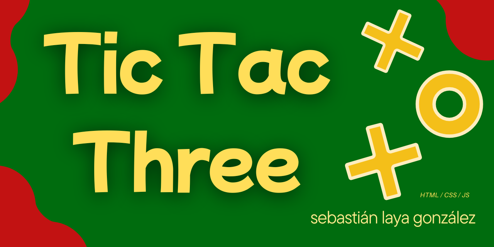
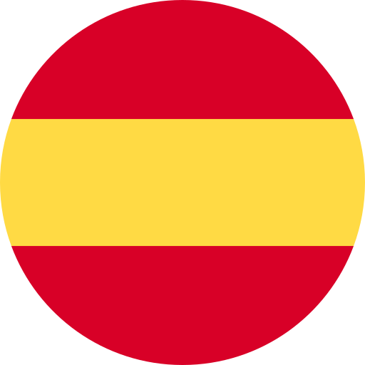
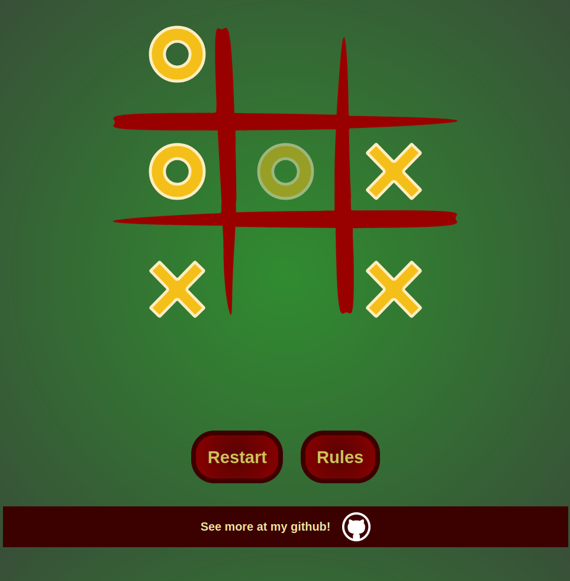

# TicTacThree
 The classic game of tictactoe but with a modification that makes it way more fun. 

 El clásico juego de tres en raya pero con una modificación que lo hace mucho más divertido

## Distribution
 In Proyect you will find the files, you just have to download it and extract the zip in case you just want to test it. Right now is working in almost every browser.

 En proyecto encontrarás los archivos, solo tienes que descargarlos y extraer el comprimido en caso de que solo quieras probarlo. Ahora mismo está funcionando para casi todos los navegadores.

## How to play?
 Make three in a row!

Use three figures to make thre in a row. Watch out, there can only be three figures at a time in the board. Once you place your next figure, the first one will dissapear.

Good luck!

 ¡Haz tres en raya!

Usa tres figuras para conseguir tres en raya. Cuidado, solamente habrán tres de tus figuras en el tablero. Al colocar la siguiente, la primera figura que habías puesto desaparecerá.

¡Buena suerte!
